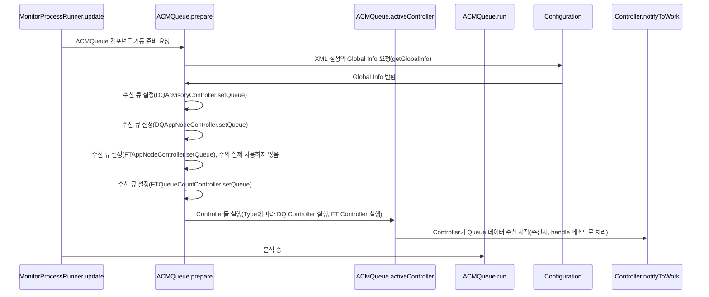

```mermaid
sequenceDiagram
    participant MonitorProcessRunner.update
    participant ACMQueue.prepare
    participant ACMQueue.activeController
    participant ACMQueue.run
    participant Configuration
    participant Controller.notifyToWork

    MonitorProcessRunner.update ->> ACMQueue.prepare : ACMQueue 컴포넌트 기동 준비 요청
    ACMQueue.prepare ->> Configuration : XML 설정의 Global Info 요청(getGlobalInfo)
    Configuration ->> ACMQueue.prepare : Global Info 반환
    ACMQueue.prepare ->> ACMQueue.prepare : 수신 큐 설정(DQAdvisoryController.setQueue)
    ACMQueue.prepare ->> ACMQueue.prepare : 수신 큐 설정(DQAppNodeController.setQueue)
    ACMQueue.prepare ->> ACMQueue.prepare : 수신 큐 설정(FTAppNodeController.setQueue), 주의 실제 사용하지 않음
    ACMQueue.prepare ->> ACMQueue.prepare : 수신 큐 설정(FTQueueCountController.setQueue)
    ACMQueue.prepare ->> ACMQueue.activeController : Controller들 실행(Type에 따라 DQ Controller 실행, FT Controller 실행)
    ACMQueue.activeController ->> Controller.notifyToWork : Controller가 Queue 데이터 수신 시작(수신시, handle 메소드로 처리)
    MonitorProcessRunner.update ->> ACMQueue.run : 분석 중
```
